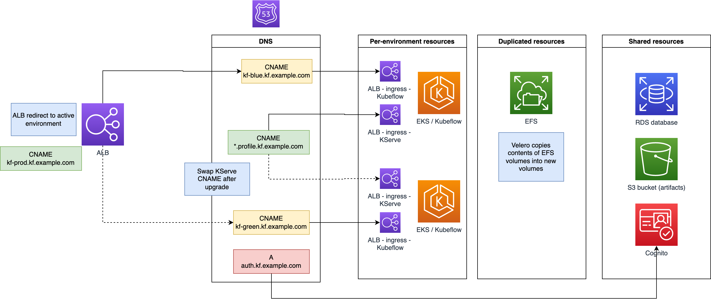

+++
title = "Upgrade"
description = "Upgrading Kubeflow"
weight = 90
+++

Kubeflow does not natively offer an upgrade process. An in-place upgrade often works, but we recommend a blue/green upgrade process that provides a fail-back capability. We will leverage integration with AWS storage and database services to let us deploy a new EKS cluster with Kubeflow and connect it to the external data stores. We will also use an open-source tool to copy certain resources from the production EKS cluster to the new one, and use AWS Backup to snapshot the state of our external data stores.

At this time, the upgrade process is only tested using these two configurations:

* RDS and S3 and the Terraform deployment option
* Cognito, RDS, and S3 and the Terraform deployment option

We recommend using EFS or FSx for volume storage, but EBS volumes are supported as well.

## Upgrade methodology

Using a blue/green pattern lets us deploy a new EKS cluster with a new version of kubernetes, a new version of Kubeflow, or both. We do need to transfer all relevant state from the old deployment to the new one. Once the new deployment is running, you can test it and then switch traffic if the deployment was successful. We recommend performing the upgrade and associated testing during a maintenance window, as both EKS clusters will be connected to the same underlying data stores.

This diagram shows the components and DNS records involved.



There are several data stores to consider.

### AWS data stores

The recommended configuration uses S3 for artifact storage, RDS as the database, EFS or FSx for volume storage, and Cognito as an identity provider. We will use AWS Backup to take a snapshot of S3, RDS, and EFS, so that we can restore them to a known-good state if something goes wrong with the new deployment.

We will not back up Cognito as normally you don't need to make changes to identities during an upgrade test cycle.

When using Route 53 for DNS, we will make and adjust CNAME and alias records to provide end users with a consistent endpoint for accessing the Kubeflow dashboard, and to preserve model serving endpoints.

### Kubernetes resources

During Kubeflow use, users create resources like notebook instances and model serving endpoints. These exist in the user-specific namespaces. We will use [Velero](https://velero.io/), an open-source tool, to backup resources from these namespaces and recover them into the new cluster. These resources are usually custom resources, and by copying the custom resources, the resource controllers will create the associated pods and other resources.

## Upgrade steps

Now let's walk through a detailed example of a blue/green upgrade.

### Declare a maintenance window

We recommend not allowing end users to access Kubeflow until testing is complete and you are ready to direct traffic to the new cluster. Otherwise, users may be performing activity that will not show up in the new cluster.

### Install Velero CLI

On the EC2 or Cloud9 instance you are using, [install the Velero CLI](https://velero.io/docs/v1.10/basic-install/#install-the-cli). Make sure you are using version 1.10 or later.

### Configure Velero in production cluster

Make sure that you enabled Velero when deploying the production cluster. If not, enable it by setting the variable `using_velero = true` and redeploy the Terraform stack.

If your production deployment used a version of Kubeflow on AWS that did not include support for deploying Velero with Terraform, see the note about [installing Velero manually)().

Note the name of the S3 bucket you use for Velero, as we'll need that later on.

### Switch to new version of Kubeflow release

We will create a new clone of the GitHub repository for the new deployment. 

#### Optional: Deploy new Cloud9 or EC2 instance

Using a new Cloud9 or EC2 instance lets you maintain clear separation between deployments. If you want to do this, follow the steps in [Create Ubuntu environment](). 

#### Complete other prerequisites

Follow the steps in [Clone repository](). Be sure to use the newer version of Kubeflow in these steps.

#### Optional: Deploy other prerequisites on new Cloud9 or EC2 instance

If you set up a new Cloud9 or EC2 instance, follow the steps in [Install necessary tools]() and [Configure AWS Credentials and Region for Deployment](). Then [install the Velero CLI](https://velero.io/docs/v1.10/basic-install/#install-the-cli).

### Configure backup EKS cluster

Next, we will create a new `sample.auto.tfvars` file to configure the new deployment. This will consist of three steps - basic deployment information, information about the production deployment, and additional upgrade information.

#### Basic deployment information

Execute this step on the Cloud9 or EC2 instance you are using for the new cluster. 

In the new clone of the GitHub repository, go to the `upgrade` directory.

```bash
cd $REPO_ROOT/deployments/upgrade/terraform
```

Copy the `sample.auto.tfvars` file from the production deployment into this directory. If you did not use Terraform to create the production deployment, create the file `sample.auto.tfvars` with these entries:

```bash
cluster_name="<cluster name>"
cluster_region="<cluster region>"
use_rds="true"
use_s3="true"
use_efs="<EFS enabled?>"
use_fsx="<FSx enabled?>"
```

If you want to use Cognito and Route 53, the file also needs these entries:

```bash
aws_route53_subdomain_zone_name="<subdomain zone name>"
use_cognito="true"
load_balancer_scheme="internet-facing"
```

Edit the `sample.auto.tfvars` file and make these changes:

* Set the name of the backup EKS cluster in the `cluster_name` variable. 
* If you are not intending to use Cognito, set `use_cognito=false`.

The other variables can stay the same.

#### Information about the production deployment

In order to do a blue/green upgrade, we must have the following information about the production cluster.

* src_vpc_private_subnets - VPC private subnets
* src_vpc_public_subnets - VPC public subnets
* src_vpc_id - VPC ID
* src_vpc_cidr - VPC CIDR
* src_efs_fs_id - EFS file system ID
* src_cluster_sg_id - Security group used for EKS and RDS
* src_s3_secret_name - Secret used for S3 credentials
* src_s3_bucket_name - Artifact bucket
* src_rds_secret_name - Secret used for RDS credentials
* src_rds_endpoint - RDS endpoint

If using Cognito, we also need to provide information about the existing Cognito domain and Route 53:

* user_pool_id - Cognito user pool ID
* cognito_user_pool_arn - Cognito user pool ARN
* cognito_user_pool_domain - Cognito user pool domain
* certificate_arn - ARN of the wildcard certificate for the subdomain
* src_stage - Stage name in the CNAME for the existing deployment (may be empty)

We can obtain most of this information automatically if you deployed the production cluster using manifests or Terraform. You can however always set these variables manually.

#### Production deployment information gathering - manifest deployment

Execute this step on the Cloud9 or EC2 instance you are using for the production cluster. 

Use this section if you deployed the production cluster with the manifest approach.

Make sure you have set all the proper environment variables as you did when you installed the cluster. 

Go to the directory `deployments/upgrade-baseline` and run:

```bash
python get_cluster_variables.py \
    --region $CLUSTER_REGION \
    --cluster $CLUSTER_NAME \
    --bucket $S3_BUCKET \
    --rds_secret_name $RDS_SECRET_NAME \
    --s3_secret_name $S3_SECRET_NAME \
    --efs_name $CLAIM_NAME
```

This produces a file called `upgrade.tfvars`.

If you are using Cognito, also add lines in `upgrade.tfvars` for the user pool and certificate information. In the manifest deployment approach the Cognito setup is done manually, so we cannot obtain this information automatically.

```bash
user_pool_id = ""
cognito_user_pool_arn = ""
cognito_user_pool_domain = ""
certificate_arn = ""
```

Copy the output file `upgrade.tfvars` to the EC2 or Cloud9 instance you are using for the new deployment.

In the directory for the new deployment, copy the `upgrade.tfvars` file into the directory, then run:

```bash
cat upgrade.tfvars >> sample.auto.tfvars
```

#### Production deployment information gathering - Terraform deployment

Execute this step on the Cloud9 or EC2 instance you are using for the production cluster. 

Use this section if you deployed the production cluster with the Terraform approach.

Go to the directory `deployments/upgrade-baseline` and run:

```bash
python get_state_variables.py \
    --statefile <path/to/terraform.tfstate>
```

This produces a file called `upgrade.tfvars`.

Copy the output file `upgrade.tfvars` to the EC2 or Cloud9 instance you are using for the new deployment.

In the directory for the new deployment, copy the `upgrade.tfvars` file into the directory, then run:

```bash
cat upgrade.tfvars >> sample.auto.tfvars
```

#### Additional upgrade information

There are five additional settings you should configure about the new deployment.

* If you want to use a different version of EKS, set the `eks_version` variable.
* If you do not want to use an ALB to provide URL redirection, or you already have one set up, set `use_alb_redirect=false`. Otherwise set `use_alb_redirect=true`.
* You can set the value of `redirect_alias`. This will be part of the URL provided to end users. The default value is `kflive`, which would yield a redirect URL of `kflive.<subdomain>`.
* Set the value of `stage`. This will be part of the URL for the new cluster. You could set this to `blue` or `candidate` for example.
* Set the value of `src_velero_bucket_name` to the bucket you configured for Velero.

### Deploy backup EKS cluster

Execute this step on the Cloud9 or EC2 instance you are using for the new cluster. 

Now deploy the backup cluster.

```bash
make deploy
```

### Execute an on-demand backup

Execute this step on the Cloud9 or EC2 instance you are using for the production cluster. 

The deployment process creates an AWS Backup vault and associated IAM role to use. Go to the production deployment directory and run this script:

```bash
cd $REPO_ROOT/deployments/rds-s3/terraform
../../../tests/e2e/utils/snapshot-state.sh
```

The script will wait for the jobs to complete. Confirm that all backups completed successfully.

If the version of Kubeflow for AWS that you used to create your production cluster did not create a backup vault, you can create one manually following the [instructions in the documentation](https://docs.aws.amazon.com/aws-backup/latest/devguide/creating-a-vault.html). 

If you did not deploy your cluster with Terraform, you can manually enter the variables in the `snapshot-state.sh` script:

```bash
VAULT=<name of backup vault>
ROLE_ARN=<ARN of backup role>
EFS_ARN=<ARN of EFS file system>
S3_ARN=<ARN of artifact bucket>
RDS_ARN=<ARN of database instance>
```

### Execute the upgrade

#### Mark the persistent volumes you want to back up

Execute this section on the Cloud9 or EC2 instance you are using for the production cluster.

Persistent volumes for notebooks are cluster-level resources, although the volume claims are in the user-level namespaces. However, the Velero custom resources that represent volume backups live in the `velero` namespace. We do not want to restore the entire `velero` namespace later, as that would include volumes from Velero pods.

So, we will annotate the volumes we want to back up. For each persistent volume that uses EFS or FSx, run this command:

```bash
kubectl -n <namespace> annotate pod/<pod name> backup.velero.io/backup-volumes=<volume name>
```

For example, if the user `user@example.com` has a notebook called `mynb`, you would run:

```bash
kubectl -n kubeflow-user-example-com annotate pod/mynb-0 backup.velero.io/backup-volumes=mynb-volume
```

Note that Velero normally uses the CSI driver's snapshot capability to backup and restore volumes. That works well with EBS. However, EFS and FSx do not support snapshots in the respective CSI drivers. Velero handles EFS and FSx with its file system backups, which use a node agent to copy data out of the EFS or FSx volume into Velero's S3 bucket, and then from that bucket into a new volume. That process may be slow for larger volumes.

#### Back up resources from production cluster

Execute this section on the Cloud9 or EC2 instance you are using for the production cluster.

Execute a velero backup. We need to include at least the following resources:

* The `velero` namespace, as it contains information about persistent volume backups
* All user namespaces
* Cluster-scoped resources like profiles

For the sake of convenience, you can back up the entire cluster and selectively restore the correct resources later on.

```bash
velero backup create test1 --wait --default-volumes-to-fs-backup=false
```

Wait until the backup is completed.

```bash
velero backup describe test1 # check for the Phase output
```

#### Configure new cluster for knative serving

If you use knative serving, you need to set up the new cluster for model serving.

First, edit the config map `config-domain` in the `knative-serving` namespace. Set the default domain to the subdomain you are using for Kubeflow.

Next, follow the steps in the [Create ingress](https://awslabs.github.io/kubeflow-manifests/docs/component-guides/kserve/tutorial/#create-ingress) section to configure the ingress controller. You can reuse the same certificate you used for the production cluster.

Finally, follow the steps in [Run a sample inference service](https://awslabs.github.io/kubeflow-manifests/docs/component-guides/kserve/tutorial/#run-a-sample-inferenceservice) to add an authorization policy.

#### Provision persistent volumes for FSx

Velero does not support restoring persistent volumes created with static provisioning, which we use for FSx. If you use FSx volumes, recreate the persistent volumes manually. Velero will bind the persistent volume claim automatically.

#### Restore resources into new cluster.

Execute this section on the Cloud9 or EC2 instance you are using for the new cluster.

Restore the backup. You must include all user namespaces and the `velero` namespace.

```bash
velero restore create --from-backup test1 \
    --include-namespaces kubeflow-user-example-com,velero \
    --include-resources persistentvolume,persistentvolumeclaim,namespace,image,notebook,profile,inferenceservice,configmap,podvolumebackup,pod,serviceaccount \
    --include-cluster-resources \
    --wait
```

Wait until the restore completes. You can then connect to your cluster at this URL:

    terraform output -raw kubelow_platform_domain

#### Update DNS records

We use an ALB to provide a redirection point to the active cluster. The ALB rule normally redirects to the production cluster. Once testing is complete, you need to update the listener rule to point to the CNAME record for the new cluster. We cannot use a simple Route 53 alias record as the Cognito redirection URLs have to match the URL in the browser. After completing this step, you can access this URL:

    terraform output -raw kubelow_alias

If you have serving endpoints deployed, you will need to update the CNAME record that you created in [Add DNS records](https://awslabs.github.io/kubeflow-manifests/docs/component-guides/kserve/tutorial/#add-dns-records). It should now point to the ingress for the new cluster.

## Notes

### Installing Velero manually

If you deployed your production cluster without Velero, you will need to install it. We recommend using the [EKS Terraform Blueprints](https://github.com/aws-ia/terraform-aws-eks-blueprints). 

Clone the latest copy of the GitHub repository on the EC2 or Cloud9 instance you are using for the production cluster. If you installed with kustomize, make sure you have set all the proper environment variables as you did when you installed the cluster. If you do not have these environment variables set because you installed with Terraform, you can obtain the values by searching for the variables `s3_secret`, `rds_secret`, and `artifact_store` in `terraform.tfstate`.

Go to the directory `deployments/upgrade-baseline` and run this script to create a Terraform variables file:

```bash
python get_cluster_variables.py \
    --region $CLUSTER_REGION \
    --cluster $CLUSTER_NAME \
    --bucket $S3_BUCKET \
    --rds_secret_name $RDS_SECRET_NAME \
    --s3_secret_name $S3_SECRET_NAME \
    --efs_name $CLAIM_NAME
```

If you do not have Terraform installed, follow the normal [installation process](https://developer.hashicorp.com/terraform/tutorials/aws-get-started/install-cli). You will need Terraform < 1.3.0.

Now deploy the stack.

```bash
cd terraform
terraform init
terraform apply -auto-approve
```

### Multiple upgrades

The original production cluster deployment creates the underlying AWS storage resources in S3, RDS, and EFS (or FSx). Future deployments read information about those resources from the Terraform state of the original deployment. You can continue to follow the upgrade process in the future to deploy new versions of Kubeflow and/or EKS. Just remember to use the correct kubectl contexts when executing the Velero backups.

### Deleting old clusters

You can remove older deployments when satisfied with testing. Specifically, you can delete the EKS cluster used for an older deployment, as the upgrade process only needs information about the VPC, RDS, EFS or FSx, S3, Cognito, Route 53, and any certificates created. You should retain the backup vault as we reuse that. We also use the original EKS cluster security group for the RDS database as well, so you will need to retain that security group.

If you deployed with Cognito, you will need to make sure that you adjust the `A` record for the subdomain apex to point to the ingress controller for the new cluster.

### Resources in scope for Velero backup

While Velero can back up an entire EKS cluster, we only need a few resource types.

* persistentvolume (global)
* persistentvolumeclaim (user profile namespace)
* namespace (only for user profile namespaces)
* image (user profile namespace)
* notebook (user profile namespace)
* profile (global)
* inferenceservice (user profile namespace)
* configmap (user profile namespace)
* podvolumebackup (velero namespace)
* pod (user profile namespace) 

Note that we only need pods as Velero looks for pods with associated podvolumebackup resources when deciding whether to restore a persistent volume.

### Occasional run status unknown

Occasionally you may notice that a workflow run shows with an unknown status. If you look at the logs for the pod `ml-pipeline-persistenceagent-YYYY` in the `kubeflow` namespace, you may see messages like this:

```
time="YYYY-MM-DDTHH:mm:ssZ" level=error msg="Permanent failure while syncing resource (kubeflow-user-example-com/pipeline-id)
```

These errors prevent the run status from persisting to the database. This error does not appear to be related to the upgrade process, as it can manifest before the new cluster is deployed.